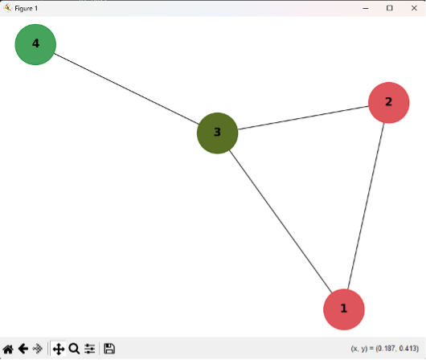

# Bron-Kerbosch Algorithm 🔍

Этот репозиторий содержит реализацию **алгоритма Брона-Кербоша** для поиска максимальных клик в графе.

## 📌 Описание
**Алгоритм Брона-Кербоша** — это эффективный метод поиска **максимальных клик** в неориентированном графе.  
В этом проекте представлена его реализация на **Python** с использованием библиотеки `networkx`.

## 🚀 Как запустить?
### 1️⃣ Установить зависимости
Убедитесь, что у вас установлен Python 3.10+. Установите библиотеки:
```bash
pip install networkx matplotlib
```

### 2️⃣ Запустить алгоритм
```bash
python bron_kerbosch.py
```

## 🖼 Пример работы
После запуска программа визуализирует граф и найденные **максимальные клики**.  
Пример графа с кликами:  


## 📂 Файлы в репозитории
- `bron_kerbosch.py` — код алгоритма.
- `Курсовая_Брон_Кербоша.docx` — описание алгоритма.
- `graph.png` — изображение графа.

## 📝 Лицензия
Этот проект распространяется под лицензией MIT.

