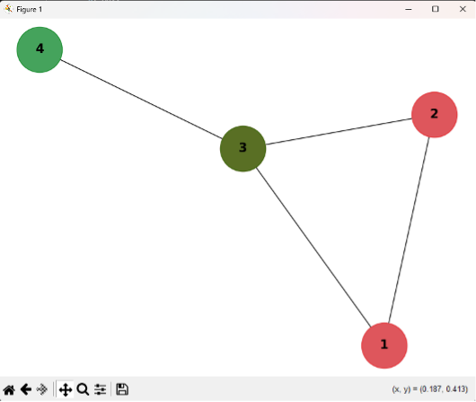

# Bron-Kerbosch Clique Finder 🔍

Python implementation of the **Bron-Kerbosch algorithm** for finding all maximal cliques in an undirected graph. Includes both the basic recursive version and the optimized version with **pivot selection**.

## What is a Maximal Clique?

A **clique** is a subset of vertices where every pair is connected by an edge.  
A **maximal clique** is a clique that cannot be extended by adding any more vertices.

## Algorithm Versions

| Version | Function | Time Complexity |
|---------|----------|-----------------|
| Basic | `bron_kerbosch()` | O(3^(n/3)) |
| With pivot | `bron_kerbosch_pivot()` | Better in practice — fewer recursive calls |

The **pivot optimization** selects the vertex with the most connections to candidates at each step, significantly reducing the search space.

## Tech Stack

- Python 3.10+
- [NetworkX](https://networkx.org/) — graph library
- [Matplotlib](https://matplotlib.org/) — visualization

## Installation

```bash
git clone https://github.com/vevdokimovm/bron-kerbosch-clique-finder.git
cd bron-kerbosch-clique-finder
pip install -r requirements.txt
```

## Usage

```bash
python bron_kerbosh.py
```

Or use as a module:

```python
import networkx as nx
from bron_kerbosh import find_maximal_cliques

G = nx.Graph()
G.add_edges_from([(1, 2), (1, 3), (2, 3), (3, 4)])

cliques = find_maximal_cliques(G)
print(cliques)  # [{1, 2, 3}, {3, 4}]
```

## Example Output

```
Граф 1 — максимальные клики: [{1, 2, 3}, {3, 4}]
Граф 2 — максимальные клики: [{1, 2, 5}, {2, 3, 4}, {4, 5}, {4, 6}]
```



## Project Structure

```
bron-kerbosch-clique-finder/
├── bron_kerbosh.py   # Algorithm implementation + visualization
├── requirements.txt
├── picture1.png      # Example graph visualizations
├── picture2.png
├── picture3.png
└── README.md
```

## License

MIT
